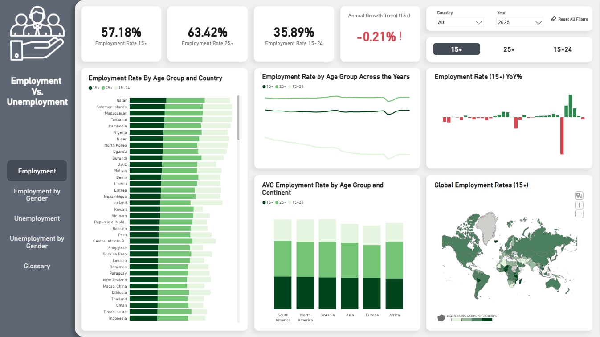
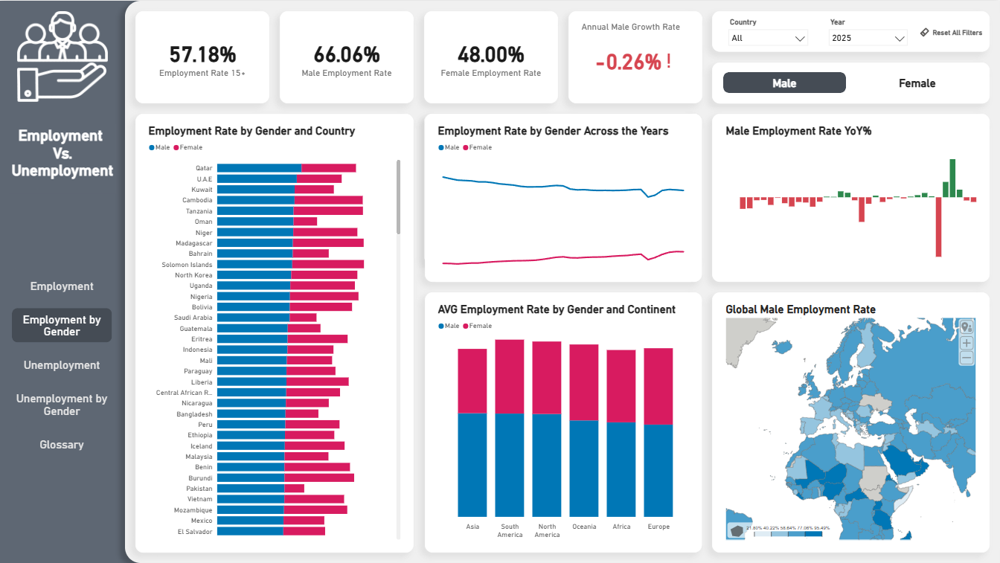
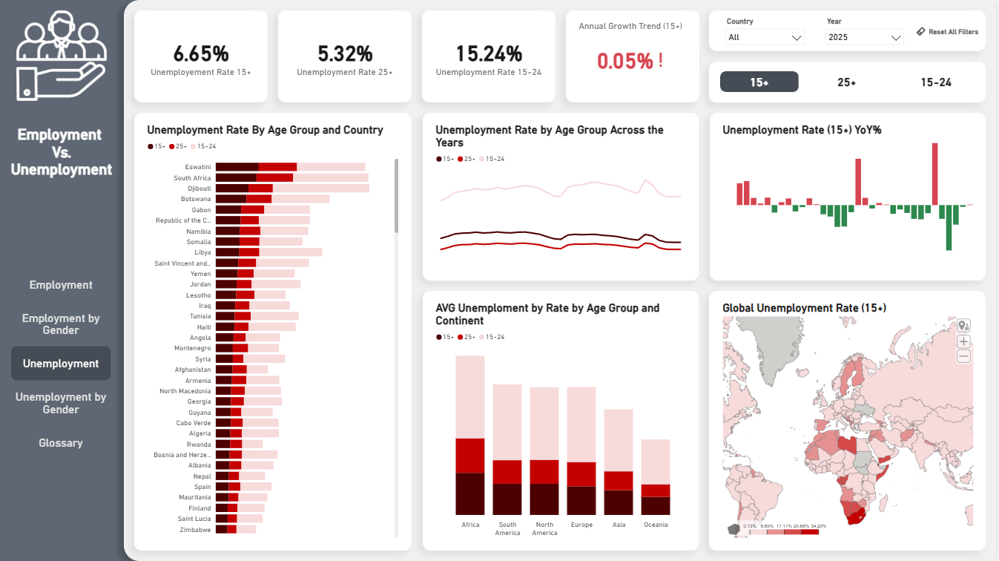
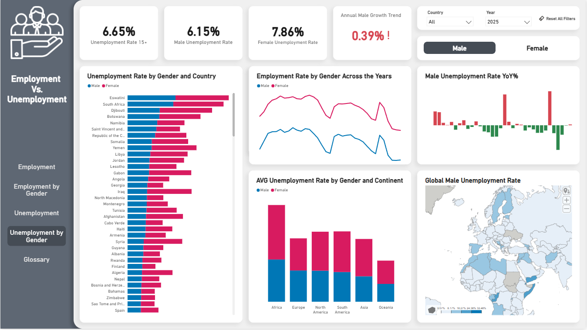

# Employment Vs. Unemployment

## Overview
An interactive Power BI report analyzing global employment and unemployment rates
across 195 countries from 1991 to 2025, broken down by age group, gender, continent and country.

## Tools Used
- Power BI
- Power Query

## Dataset
Source: [Global Employment & Unemployment Rates 1991-2025 - Kaggle](https://www.kaggle.com/datasets/lucalullo/global-employment-unemployment-rates-1991-2025)

## Data Preparation
- Data cleaning and manipulation done in Power Query
- Original tables: Employment (occupazione) and Unemployment (disoccupazione)
- Created a Country table with country, continent and ISO codes derived from the original tables
- Created a Calendar table (Date) for time intelligence
- Measures created in Power BI
- No NULL values found

## What Was Built
- Multi-page dashboard covering Employment, Employment by Gender,
  Unemployment, Unemployment by Gender and a Glossary
- KPI cards displaying employment and unemployment rates by age group (15+, 25+, 15-24)
- Annual growth trend indicators per age group
- Country and year filters for dynamic analysis
- Global map visualization for geographic distribution
- Continental and country-level breakdowns by age group and gender

## Key Insights

**General (1991–2025)**
- 1991 was the year with the highest global employment rate reaching 57.41% (15+)
- 2020 was the year with the highest global unemployment rate reaching 8.13% (15+)

---

**Employment (2025)**
- Global employment rate for 15+ stands at 57.18% with an annual growth
  trend of -0.21%
- South America has the highest employment rate (15+) across all continents
- Oceania has the highest youth employment rate (15-24)
- Qatar is the country with the highest male employment rate
- Solomon Islands is the country with the highest female employment rate

---

**Employment by Gender (2025)**
- Males have the highest employment rate (15+) at 66.06% vs females at 48.00%
- Europe has the highest female employment rate at 51.44%
- Asia has the highest male employment rate

---

**Unemployment (2025)**
- Global unemployment rate for 15+ sits at 6.65% with an annual growth
  trend of 0.05%
- Youth unemployment (15-24) is significantly higher at 15.24% compared
  to the 25+ rate of 5.32%
- Africa has the highest unemployment rate across all continents including
  youth unemployment (15-24) with the highest male (8.10%) and female (10.46%) rates

---

**Unemployment by Gender (2025)**
- Eswatini leads as the country with the highest male (32.56%)
  and female (36.03%) unemployment rates
- Oceania has the lowest unemployment rate with male at 3.42% and female at 4.47%

---

## Live Dashboard
You can also view the dashboard directly on Power BI: 

## Author
Fábio Tavares | 2026
